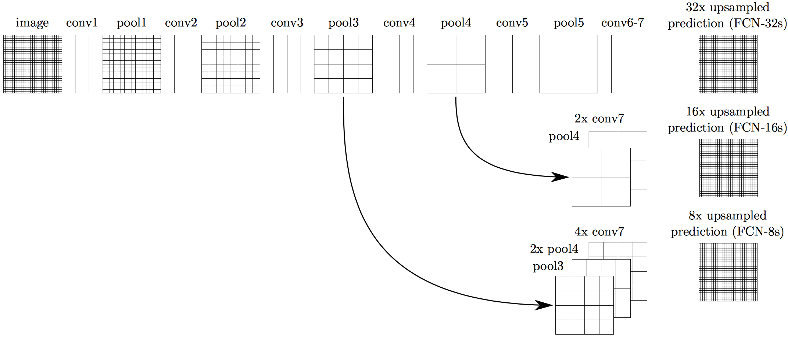

# Semantic Segmentation Project
The goals / steps of this project are the following:

* Reuse a pre-trained VGG neural network for extracting low-level image features.
* Build a Fully Convolutional Network (FCN) to upsample the extracted features for classifying every pixel of an image.
* Train the FCN with road images.
* Callsify road pixels of sample images and videos (optional).

## [Rubric](https://review.udacity.com/#!/rubrics/989/view) Points
#### Here I consider the rubric points individually and describe how I addressed each point in my implementation.  

---
### Build the Neural Network

#### 1. Does the project load the pretrained vgg model?

Yes, see function `load_vgg` in `main.py`. VGG-16 layers 3, 4 and 7 are used for building the rest of FCN.

#### 2. Does the project learn the correct features from the images?

Yes, see function `layers` in `main.py`. The network architecture is inspired by the paper [Fully Convolutional Networks for Semantic Segmentation](https://people.eecs.berkeley.edu/~jonlong/long_shelhamer_fcn.pdf) by Jonathan Long et al. The network architecture is based on FCN-8s:
<p align="center"></p>

VGG-16 network is decapitated by discarding the final classifier layer, and then all fully connected layers are converted to to convolutions. The output of VGG-16 is appended a 1×1 convolution to predict scores for each of the two classes (road and background) at each of the coarse output locations, followed by a deconvolution layer to bilinearly upsample the coarse outputs to pixel-dense outputs.

While the fully convolutionalized classifier can be fine-tuned to segmentation, its output is dissatisfyingly coarse. The issue is addressed by adding skips that combine the final prediction layer with lower layers with finer strides. Combining fine layers and coarse layers lets the model make local predictions that respect global structure. The output stride is first devided in half by predicting from a 16 pixel stride layer. Then a 1×1 convolution layer is added on top of pool4 to produce additional class predictions. This output is fused with the predictions computed on top of conv7 (convolutionalized fc7) at stride 32 by adding a 2× upsampling layer and summing both predictions. This net is called FCN-16s. FCN-16s is learned end-to-end, initialized with the parameters of the last, coarser net, which is called FCN-32s. We continue in this fashion by fusing predictions from pool3 with a 2× upsampling of predictions fused from pool4 and conv7, building the net FCN-8s.

However the result of an FCN-8s inference directly upsampled to the original image size appears to be quite noisy, with distinct mislassified pixels on the road and background. This is addressed by applying a gradual 4x upsampling, 3x3 convolution (with ELU activation), 2x downsampling, repeated 3x times, as proposed by Jose Rojas in the CarND channel #p-advanced-deep-learn. This operation finds correlation of adjacent pixels and prevents misclassification of distinct pixels.

#### 3. Does the project optimize the neural network?

Yes, see function `optimize` in `main.py`. The optimization is done by minimizing the cross entropy loss with an Adam optimizer.

#### 4. Does the project train the neural network?

Yes, see function `train_nn` in `main.py`. Three metrics are printed out when training the network:
1. Cross entropy loss.
2. Mean intersection-over-union (IOU).
3. Accuracy.

---
### Neural Network Training

#### 1. Does the project train the model correctly??

The cross entropy loss decreases over time, mean IOU and accuracy grows, see the sample output:
```
Epoch 1, loss 0.607021, mIOU 0.359799, accuracy 0.610424
Epoch 2, loss 0.466800, mIOU 0.393843, accuracy 0.692847
Epoch 3, loss 0.306949, mIOU 0.413960, accuracy 0.783909
Epoch 4, loss 0.275291, mIOU 0.402880, accuracy 0.797167
Epoch 5, loss 0.246603, mIOU 0.401349, accuracy 0.797912
Epoch 6, loss 0.240045, mIOU 0.416302, accuracy 0.804545
Epoch 7, loss 0.240057, mIOU 0.482382, accuracy 0.829934
Epoch 8, loss 0.246736, mIOU 0.589522, accuracy 0.861102
Epoch 9, loss 0.232936, mIOU 0.698462, accuracy 0.898767
Epoch 10, loss 0.221611, mIOU 0.753132, accuracy 0.915408
Epoch 11, loss 0.222437, mIOU 0.772429, accuracy 0.920976
Epoch 12, loss 0.201114, mIOU 0.774597, accuracy 0.923536
Epoch 13, loss 0.214545, mIOU 0.794024, accuracy 0.930096
Epoch 14, loss 0.210365, mIOU 0.805575, accuracy 0.931706
Epoch 15, loss 0.203712, mIOU 0.814137, accuracy 0.936679
Epoch 16, loss 0.213472, mIOU 0.825087, accuracy 0.938059
Epoch 17, loss 0.192808, mIOU 0.827173, accuracy 0.941940
Epoch 18, loss 0.198098, mIOU 0.833778, accuracy 0.942115
Epoch 19, loss 0.186898, mIOU 0.832974, accuracy 0.941106
Epoch 20, loss 0.182645, mIOU 0.844124, accuracy 0.946217
Epoch 21, loss 0.178962, mIOU 0.851548, accuracy 0.949424
Epoch 22, loss 0.178230, mIOU 0.858812, accuracy 0.952087
Epoch 23, loss 0.180235, mIOU 0.854200, accuracy 0.951441
Epoch 24, loss 0.170832, mIOU 0.863108, accuracy 0.952931
Epoch 25, loss 0.170945, mIOU 0.871531, accuracy 0.956311
Epoch 26, loss 0.173481, mIOU 0.871664, accuracy 0.956982
Epoch 27, loss 0.153773, mIOU 0.873445, accuracy 0.958036
Epoch 28, loss 0.150145, mIOU 0.887001, accuracy 0.961161
Epoch 29, loss 0.164759, mIOU 0.885507, accuracy 0.961393
Epoch 30, loss 0.151619, mIOU 0.890952, accuracy 0.963503
Epoch 31, loss 0.149822, mIOU 0.895664, accuracy 0.965405
Epoch 32, loss 0.141977, mIOU 0.901463, accuracy 0.967272
```

#### 2. Does the project use reasonable hyperparameters?

The final model was trained on NVIDIA Tesla K80 for 80 epochs with batch size 50. For better generalization, the dropout keep probability was set to 0.5, learning rate 5e-4, L2-regularizer was initialized with 1e-3.

#### 3. Does the project correctly label the road?

### Introduction
In this project, you'll label the pixels of a road in images using a Fully Convolutional Network (FCN).

### Setup
##### Frameworks and Packages
Make sure you have the following is installed:
 - [Python 3](https://www.python.org/)
 - [TensorFlow](https://www.tensorflow.org/)
 - [NumPy](http://www.numpy.org/)
 - [SciPy](https://www.scipy.org/)
##### Dataset
Download the [Kitti Road dataset](http://www.cvlibs.net/datasets/kitti/eval_road.php) from [here](http://www.cvlibs.net/download.php?file=data_road.zip).  Extract the dataset in the `data` folder.  This will create the folder `data_road` with all the training a test images.

### Start
##### Implement
Implement the code in the `main.py` module indicated by the "TODO" comments.
The comments indicated with "OPTIONAL" tag are not required to complete.
##### Run
Run the following command to run the project:
```
python main.py
```
**Note** If running this in Jupyter Notebook system messages, such as those regarding test status, may appear in the terminal rather than the notebook.

### Submission
1. Ensure you've passed all the unit tests.
2. Ensure you pass all points on [the rubric](https://review.udacity.com/#!/rubrics/989/view).
3. Submit the following in a zip file.
 - `helper.py`
 - `main.py`
 - `project_tests.py`
 - Newest inference images from `runs` folder
 
 ## How to write a README
A well written README file can enhance your project and portfolio.  Develop your abilities to create professional README files by completing [this free course](https://www.udacity.com/course/writing-readmes--ud777).
